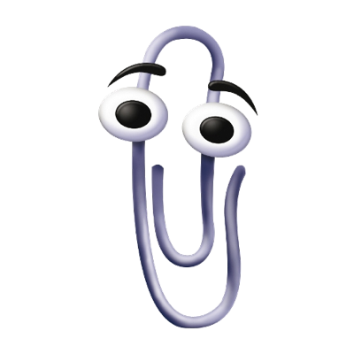

# Clippy User Guide

Clippy is a Java-based task management application designed to help users organize their tasks efficiently. With features such as adding deadlines, managing to-dos, and tracking progress, Clippy provides a simple yet powerful interface for boosting productivity.

---

## List of Commands
To use the app, you have to type in the commands in the command box and press Enter. Here are the available commands:

- [help](#help-command) - Display help information
- [add](#add-command) - Add a new task 
- [list](#list-command) - List all tasks
- [delete](#delete-command) - Delete a task
- [mark](#mark-command) - Mark a task as completed
- [unmark](#unmark-command) - Unmark a completed task
- [find](#find-command) - Find tasks by keyword
- [help](#help-command) - Show help information
- [exit](#exit-command) - Exit the application
- [deadline](#deadline-command) - Add a task with a deadline
- [todo](#todo-command) - Add a to-do task
- [event](#event-command) - Add an event task

## Help Command:
Usage:
> help
## Add Command
Usage:
> add <task_description>
## List Command
Usage:
> list
## Delete Command
Usage:
> delete <task_number>
## Mark Command
Usage:
> mark <task_number>
## Unmark Command
Usage:
> unmark <task_number>
## Find Command
Usage:
> find <keyword>
## Exit Command
Usage:
> exit
## Deadline Command
Usage:
> deadline <task_description> /by <due_date>
## Todo Command
Usage:
> todo <task_description>
## Event Command
Usage:
> event <task_description> /from <start_date> /to <end_date>
## Showcase

## Additional Notes
- Ensure that dates are in the format `YYYY-MM-DD`.
